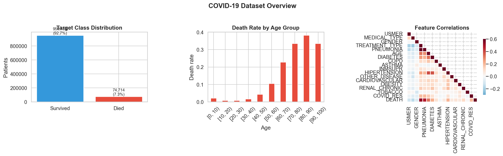
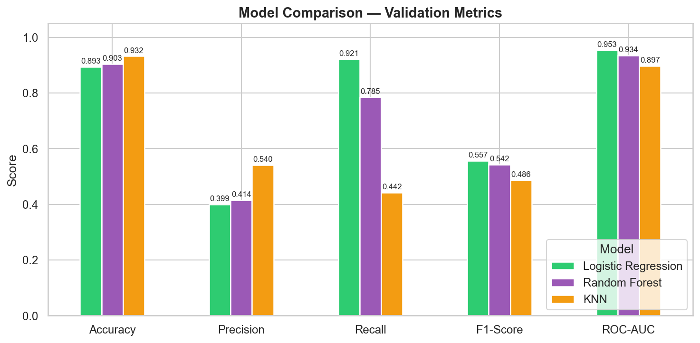
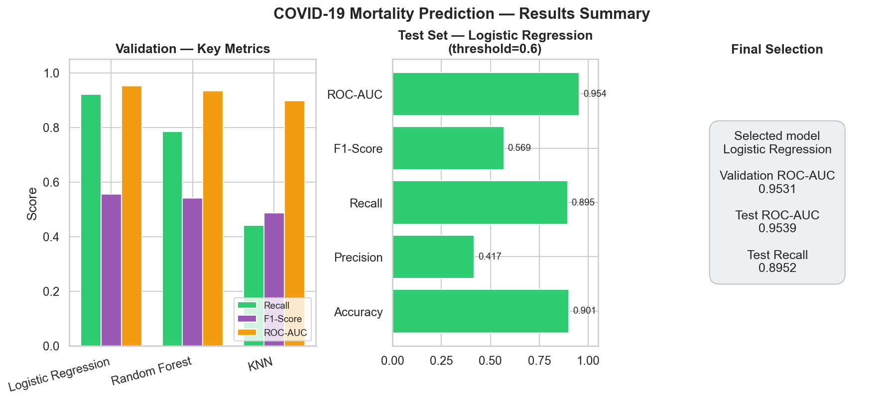

# COVID-19 Mortality Prediction — ML Classification Project

An end-to-end Machine Learning pipeline for predicting COVID-19 patient mortality using clinical and demographic features. Built with Python, Pandas, and scikit-learn.

> **Disclaimer:** This is an educational ML project. The models are not intended for clinical decision-making or medical diagnosis.

---

## Project Goal

Predict whether a COVID-19 patient is at risk of death based on their medical profile (age, pre-existing conditions, treatment type, etc.). The project demonstrates a complete ML workflow from raw data to final model selection.

---

## Dataset

The dataset contains **~1M patient records** from the Mexican government's COVID-19 surveillance system. Each row represents one patient with 21 features including:

| Feature | Description |
|---------|-------------|
| AGE | Patient's age |
| GENDER | Patient's gender |
| PNEUMONIA | Whether the patient had pneumonia |
| DIABETES | Whether the patient is diabetic |
| HIPERTENSION | Whether the patient has hypertension |
| OBESITY | Whether the patient is obese |
| COPD | Chronic obstructive pulmonary disease |
| TOBACCO | Whether the patient uses tobacco |
| CARDIOVASCULAR | Cardiovascular disease |
| RENAL_CHRONIC | Chronic renal disease |
| TREATMENT_TYPE | Outpatient (1) or hospitalized (2) |
| **DEATH** | **Target — 0 = survived, 1 = died** |

The dataset is **imbalanced**: approximately 7% of patients died.

---

## Preprocessing Steps

1. **Column renaming** — standardized column names for readability
2. **Target creation** — derived binary `DEATH` column from `DATE_DIED`
3. **Value encoding** — converted raw encoding (1=yes, 2=no, 97/98/99=unknown) to standard binary (1/0/NaN)
4. **Missing value handling** — dropped columns with >40% missing data; removed remaining rows with NaN
5. **Feature scaling** — applied StandardScaler for Logistic Regression and KNN (fit on training data only to prevent leakage)
6. **Class imbalance** — used `class_weight='balanced'` to give more weight to the minority class (deaths)

---

## Data Split Strategy

| Set | Size | Purpose |
|-----|------|---------|
| **Training** | 60% | Train the models |
| **Validation** | 20% | Compare models, tune threshold |
| **Test** | 20% | Final unbiased evaluation (used only once at the end) |

All splits use stratification to preserve the ~7% death rate in each set.

---

## Models Used

| Model | Description |
|-------|-------------|
| **Logistic Regression** | Simple, interpretable linear baseline with balanced class weights |
| **Random Forest** | Ensemble of 200 decision trees with balanced class weights |
| **K-Nearest Neighbors (KNN)** | A distance-based model that predicts based on the most similar training examples |

Compared Logistic Regression, Random Forest, and K-Nearest Neighbors using precision, recall, F1-score, ROC-AUC, and cross-validation.

---

## Evaluation & Model Selection

### Metrics

Since this is a **medical-risk classification** problem, we focus on **recall** and **F1-score** — catching true death cases (minimizing false negatives) is more important than overall accuracy.

| Metric | What It Measures |
|--------|-----------------|
| Accuracy | Overall correctness |
| Precision | Of predicted deaths, how many actually died |
| Recall | Of actual deaths, how many were correctly predicted |
| F1-Score | Harmonic mean of precision and recall |
| ROC-AUC | Model's ability to distinguish between classes |

### Cross-Validation

All models were validated using **5-fold StratifiedKFold cross-validation** on the training set. For Logistic Regression and KNN, a **sklearn Pipeline** wraps StandardScaler + the model to prevent data leakage between folds. KNN cross-validation runs on a stratified subsample (max 50,000 rows) because KNN is computationally expensive on large datasets.

### Threshold Tuning

The default classification threshold (0.5) was compared against 0.3, 0.4, and 0.6 on the **validation set**. Lowering the threshold improves recall (catches more death cases) at the cost of some precision — an acceptable trade-off in a medical-risk context.

### Final Model Selection

The model with the highest validation ROC-AUC is selected. The best threshold (by F1-score on validation) is applied. The final evaluation is performed **once** on the held-out test set to report unbiased metrics.

---

## Visualizations

### Dataset overview



### Model comparison (validation set)



### Final results summary



`modeling.ipynb` includes **per-model explanations**, validation metric charts, confusion matrices, ROC curves, a radar comparison, cross-validation, threshold tuning, and a final results dashboard. Run the notebook (or **Run All**) to render all figures.

---

## Results

### Validation Set — Model Comparison

| Model | Accuracy | Precision | Recall | F1-Score | ROC-AUC |
|-------|----------|-----------|--------|----------|---------|
| Logistic Regression | 0.8931 | 0.3988 | 0.9207 | 0.5566 | 0.9531 |
| Random Forest | 0.9034 | 0.4140 | 0.7846 | 0.5420 | 0.9345 |
| KNN | 0.9319 | 0.5404 | 0.4418 | 0.4861 | 0.8974 |

### Cross-Validation (5-Fold Stratified)

| Model | Mean F1 | Std |
|-------|---------|-----|
| Logistic Regression | 0.5573 | ±0.0021 |
| Random Forest | 0.5448 | ±0.0018 |
| KNN | 0.4858 | ±0.0018 |

### Final Test Set Results

| Metric | Value |
|--------|-------|
| Selected Model | Logistic Regression |
| Selected Threshold | 0.6 |
| Accuracy | 0.9011 |
| Precision | 0.4168 |
| Recall | 0.8952 |
| F1-Score | 0.5688 |
| ROC-AUC | 0.9539 |

### Key Takeaways

- Cross-validation confirms stable performance across all folds (very low std)
- Top predictive features include age, pneumonia, treatment type, and diabetes
- Test results closely match validation results, confirming the model generalizes well
- Logistic Regression was selected for its highest ROC-AUC and recall on validation

---

## Limitations

- **This is an educational ML project and not intended for clinical use**
- Some columns with high missing rates (ICU, INTUBED, PREGNANT) were dropped and could carry useful signal
- No hyperparameter tuning was performed; simple baseline configurations were used. Future work could include GridSearchCV or RandomizedSearchCV.
- The dataset may contain biases from the original data collection process
- Real medical prediction systems require clinical validation, regulatory approval, and domain expert involvement

---

## Project Structure

```
ds project/
├── cleaning.ipynb      # Data cleaning and exploratory data analysis
├── modeling.ipynb      # ML pipeline: training, evaluation, and model selection
├── figures/            # Static plots for README preview
├── data/
│   └── Covid_Data.csv  # Raw COVID-19 dataset
├── generate_figures.py # Regenerate figures/ PNGs
├── requirements.txt    # Python dependencies
└── README.md           # Project documentation
```

---

## How to Run

1. **Clone the repository:**
   ```bash
   git clone <repository-url>
   cd ds-project
   ```

2. **Install dependencies:**
   ```bash
   pip install -r requirements.txt
   ```

3. **Run the notebooks** in order:
   - Open `cleaning.ipynb` — data cleaning and EDA
   - Open `modeling.ipynb` — ML pipeline, evaluation, and model selection

4. **Requirements:** Python 3.8+

---

## Technologies

- Python 3
- Pandas & NumPy — data manipulation
- scikit-learn — ML models, pipelines, preprocessing, evaluation, cross-validation
- Matplotlib & Seaborn — visualization
- Jupyter Notebook — interactive development

---

## Future Improvements

- Hyperparameter tuning with GridSearchCV or RandomizedSearchCV
- Calibration curves to assess probability reliability
- Fairness analysis across demographic groups
