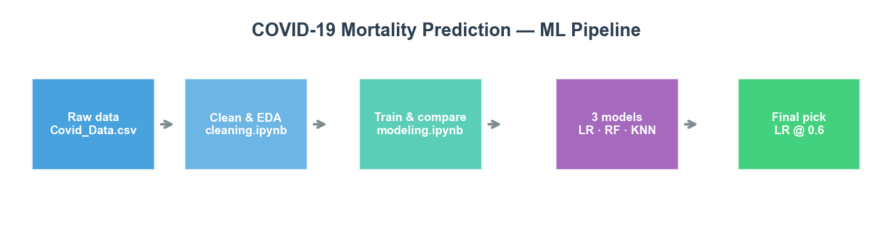
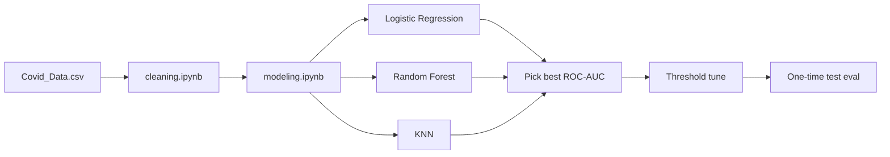

# COVID-19 Mortality Prediction

<p align="center">
  
</p>

<p align="center">
  <strong>End-to-end ML classification</strong> on ~1M Mexican COVID-19 patient records · Logistic Regression, Random Forest, KNN
</p>

<p align="center">
  
  
  
  
</p>

> **Disclaimer:** Educational project only — not for clinical decision-making or medical diagnosis.

---

## Highlights

| | |
|:--|:--|
| **Selected model** | Logistic Regression (threshold **0.6**) |
| **Test ROC-AUC** | **0.954** |
| **Test recall** | **0.895** (catches ~90% of deaths on held-out test set) |
| **Dataset** | ~1M rows → ~1.02M after cleaning · **7.3%** death rate |

---

## Pipeline at a glance

<p align="center">
  
</p>



---

## Data exploration

<p align="center">
  
</p>

**Target:** `DEATH` (0 = survived, 1 = died) · **Imbalanced** (~7% deaths)

| Feature | Description |
|---------|-------------|
| AGE | Patient age |
| PNEUMONIA, DIABETES, HIPERTENSION, OBESITY, … | Comorbidities (binary) |
| TREATMENT_TYPE | Outpatient vs hospitalized |
| **DEATH** | **Label** |

<details>
<summary><strong>Preprocessing steps</strong> (click to expand)</summary>

1. Rename columns · create `DEATH` from `DATE_DIED`
2. Encode 1/2 → 1/0 · drop high-missing columns (>40%)
3. Drop rows with NaN · stratified **60 / 20 / 20** train / val / test
4. `StandardScaler` on train only (LR & KNN) · `class_weight='balanced'` (LR & RF)

</details>

---

## Model comparison (validation)

<p align="center">
  
</p>

| Model | Recall | F1 | ROC-AUC | Notes |
|-------|--------|-----|---------|--------|
| **Logistic Regression** | **0.921** | **0.557** | **0.953** | Selected — best ranking & recall |
| Random Forest | 0.785 | 0.542 | 0.935 | Strong accuracy, lower recall |
| KNN | 0.442 | 0.486 | 0.897 | High precision, misses more deaths |

**Why recall matters:** In risk screening, missing a true death (false negative) is worse than a false alarm.

---

## Final test results

| Metric | Value |
|--------|-------|
| Accuracy | 0.901 |
| Precision | 0.417 |
| **Recall** | **0.895** |
| F1-Score | 0.569 |
| **ROC-AUC** | **0.954** |

Cross-validation F1 (5-fold): LR **0.557** ±0.002 · RF **0.545** ±0.002 · KNN **0.486** ±0.002

---

## Notebooks & more charts

| Notebook | What you get |
|----------|----------------|
| [`cleaning.ipynb`](cleaning.ipynb) | EDA, missing data, cleaning |
| [`modeling.ipynb`](modeling.ipynb) | Per-model plots, confusion matrices, **ROC curves**, **radar chart**, threshold tuning, feature importance |

Run **`modeling.ipynb` → Run All** to regenerate all interactive figures.

Regenerate README images only (fast, no training):

```bash
python generate_figures.py
```

---

## Project structure

```
ds project/
├── cleaning.ipynb
├── modeling.ipynb
├── figures/              ← README charts (PNG)
├── generate_figures.py   ← rebuild figures/
├── data/Covid_Data.csv
├── requirements.txt
└── README.md
```

---

## How to run

```bash
git clone <repository-url>
cd ds-project
pip install -r requirements.txt
jupyter notebook cleaning.ipynb   # then modeling.ipynb
```

**Requirements:** Python 3.8+

---

## Limitations

- **Not for clinical use** — no regulatory validation
- No hyperparameter tuning (baseline configs); future work: GridSearchCV / RandomizedSearchCV
- Dropped ICU / INTUBED / PREGNANT (>40% missing) may hold useful signal

---

## Tech stack

Python · Pandas · NumPy · scikit-learn · Matplotlib · Seaborn · Jupyter
