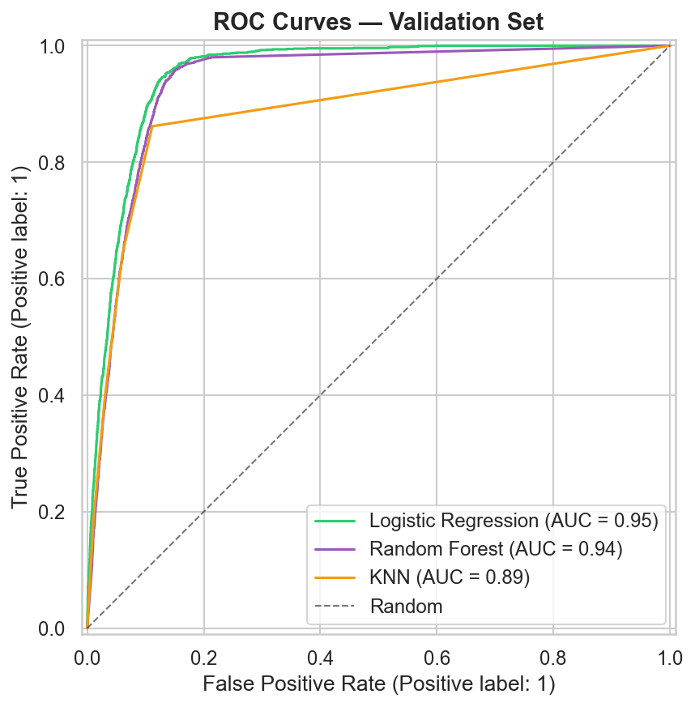
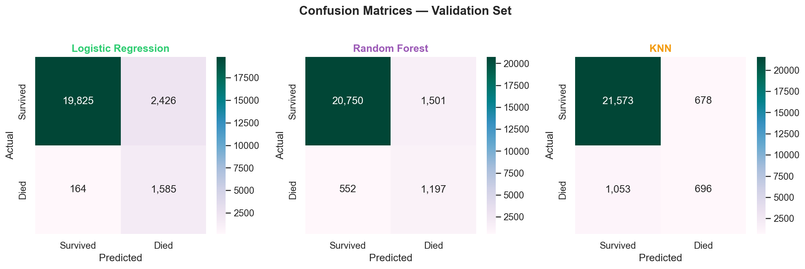
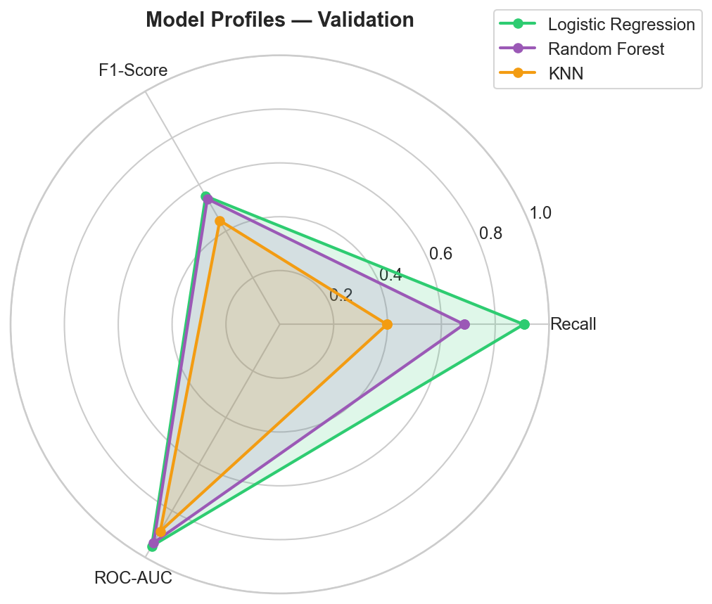
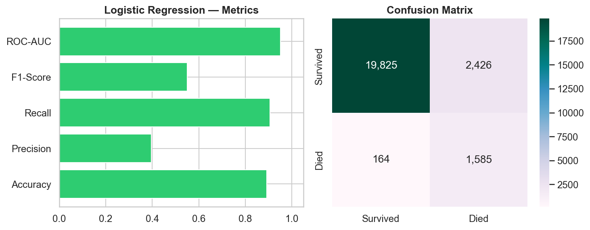
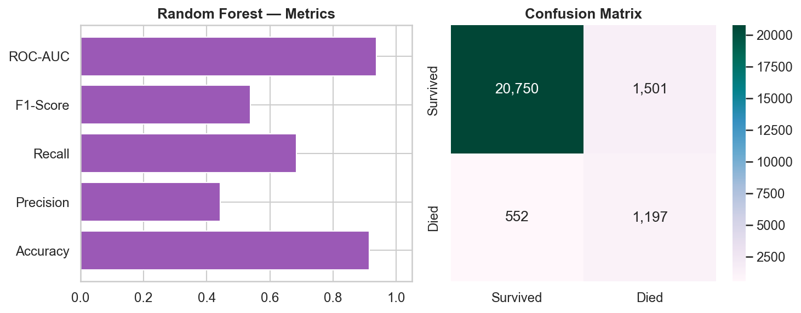
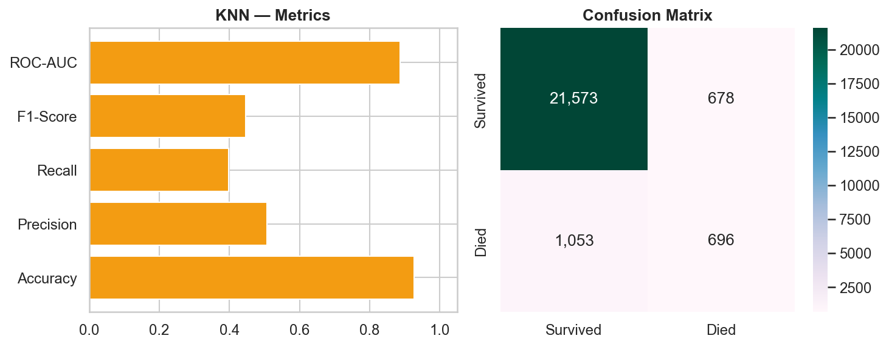

# COVID-19 Mortality Prediction

<p align="center">
  
</p>

<p align="center">
  <strong>End-to-end ML classification</strong> · ~1M patients · Logistic Regression · Random Forest · KNN
</p>

<p align="center">
  
  
  
  
  
</p>

> **Disclaimer:** Educational project only — not for clinical use.

---

## Highlights

| | |
|:--|:--|
| **Winner** | Logistic Regression @ threshold **0.6** |
| **Test ROC-AUC** | **0.954** |
| **Test recall** | **0.895** |
| **Data** | ~1M rows · **7.3%** deaths |

---

## Pipeline

<p align="center">
  
</p>

---

## Data at a glance

<p align="center">
  
</p>

---

## Model evaluation gallery

<p align="center"><strong>Compare three models on the validation set</strong></p>

<table>
<tr>
<td width="50%" align="center">
  <br/>
  <sub>All metrics side-by-side</sub>
</td>
<td width="50%" align="center">
  <br/>
  <sub>ROC curves</sub>
</td>
</tr>
<tr>
<td align="center">
  <br/>
  <sub>Confusion matrices</sub>
</td>
<td align="center">
  <br/>
  <sub>Recall · F1 · ROC-AUC radar</sub>
</td>
</tr>
</table>

### Per-model snapshots

<p align="center">
  
  
  
</p>

| Model | Recall | F1 | ROC-AUC | Verdict |
|-------|--------|-----|---------|---------|
| **Logistic Regression** | **0.921** | **0.557** | **0.953** | **Selected** |
| Random Forest | 0.785 | 0.542 | 0.935 | Strong, lower recall |
| KNN | 0.442 | 0.486 | 0.897 | High precision, misses deaths |

---

## Final test results

| Metric | Value |
|--------|-------|
| Accuracy | 0.901 |
| Precision | 0.417 |
| **Recall** | **0.895** |
| F1-Score | 0.569 |
| **ROC-AUC** | **0.954** |

---

## Notebooks (full interactive story)

| Notebook | Visuals inside |
|----------|----------------|
| [`cleaning.ipynb`](cleaning.ipynb) | Distributions, missing data, cleaning steps |
| [`modeling.ipynb`](modeling.ipynb) | **All plots above +** threshold tuning, CV, feature importance, test dashboard |

Open **`modeling.ipynb` on GitHub** — charts are embedded so you can scroll without running code.

To regenerate everything locally:

```bash
pip install -r requirements.txt
python build_visuals.py          # README figures + embed notebook images
jupyter notebook modeling.ipynb  # optional: Run All for live numbers
```

---

## Project layout

```
ds project/
├── figures/           # PNG gallery (README + notebook preview)
├── cleaning.ipynb
├── modeling.ipynb
├── build_visuals.py   # one command → all figures + notebook embed
├── generate_figures.py
├── data/Covid_Data.csv
└── requirements.txt
```

---

## Quick start

```bash
git clone <repository-url>
cd ds-project
pip install -r requirements.txt
jupyter notebook cleaning.ipynb
jupyter notebook modeling.ipynb
```

---

## Limitations

- Not for clinical use · no hyperparameter tuning (GridSearchCV possible future work)
- ICU / INTUBED / PREGNANT dropped (>40% missing)

---

## Stack

Python · Pandas · NumPy · scikit-learn · Matplotlib · Seaborn · Jupyter
